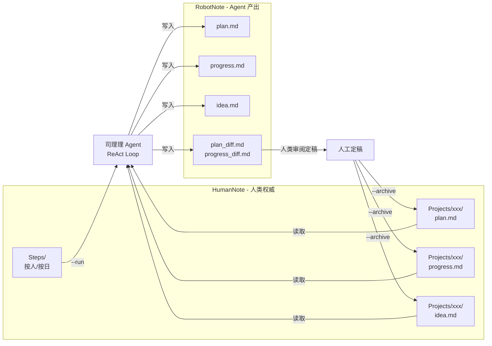

# 司理理 — 智能项目管理笔记本

司理理是一个自主 Agent，读取人类写的工作步骤（Steps），自动更新多项目的计划（Plan）、进展（Progress）、灵感（Idea），产出变更对比（Diff）供人类审阅，审阅后一键归档。

## 核心架构



**关键原则**：HumanNote 是人类权威数据源，Agent 只读不写；Agent 的所有产出写入 RobotNote，经人类审阅后通过归档命令写回 HumanNote。

## 目录结构

```
Flowus/
├── HumanNote/                  # 人类权威数据（Agent 只读）
│   ├── Projects/
│   │   └── {NNN-名称}/         # 如 001-问津/
│   │       ├── readme.md       # 项目概述
│   │       ├── {id}-plan.md    # 项目计划
│   │       ├── {id}-progress.md# 项目进展
│   │       ├── {id}-idea.md    # 项目灵感
│   │       └── history/        # 归档的历史版本
│   └── Steps/
│       └── {年}/
│           └── {人名}/         # 如 刘玮康/
│               └── {日期}.md   # 如 2026.3.31.md
├── RobotNote/                  # Agent 输出区（每次 run 前自动清理）
│   └── Projects/{NNN-名称}/
│       ├── {id}-plan.md
│       ├── {id}-progress.md
│       ├── {id}-idea.md
│       ├── {id}-plan_diff.md
│       └── {id}-progress_diff.md
├── agent/                      # 司理理 Agent 源码
│   ├── run.py                  # CLI 入口（--run / --archive）
│   ├── core.py                 # ReAct 循环引擎
│   ├── tools.py                # 工具注册表与实现
│   ├── state_manager.py        # last_run 时间戳持久化
│   ├── diff_utils.py           # unified diff 生成与 Markdown 包装
│   ├── param_config.json       # LLM 模型与参数配置
│   └── prompts/                # Jinja2 prompt 模板
│       ├── agent_system.j2     # Agent 系统 prompt
│       ├── plan_update.j2      # Plan 更新 prompt
│       └── progress_update.j2  # Progress 更新 prompt
├── base_structure/             # 共享 LLM 基础设施（submodule）
└── model_config.json           # LLM endpoint 与 API Key 配置
```

## 数据格式

### Steps（工作步骤）

每日工作记录，按日期标题分段，用项目标签标注归属：

```markdown
## **2026.3.29**
- 【001-问津】根据收集小红书信息，构建分解、入库、查询、问答的全套流程
    - todo 确定进入TIPS_DATABASE的数据范围，2天
    - idea 可以考虑用RSS替代爬虫方案
- 【002-灵枢】完成水印工具交付
    - done 财务部资质批量添加水印
```

**标记语法表**：

| 标记 | 语法 | 对 Plan 的影响 |
|------|------|---------------|
| 完成子任务 | `- done 子任务名` | 子任务状态 → ✅ 已完成 |
| 完成整体 | `- done` | 父任务状态 → ✅ 已完成 |
| 待办 | `- todo 描述，工时` | 在父任务下新增子任务 |
| 待办+重算 | `- todo 描述，工时，add` | 新增子任务，累加父任务工时 |
| 阻塞 | `- blocked by [实体名]` | 任务状态 → 🔴 阻塞 |
| 解除阻塞 | `- unblock [实体名]` | 任务状态 → 🟡 进行中 |
| 灵感 | `- idea 描述` | 追加到 idea.md |
| 新建任务 | `- plan 任务名称：xxx，负责人：xxx，工期：xd，ddl：xx/xx` | Plan 末尾新增父任务 |
| 风险 | `- risk 描述` | 仅记录，不触发 Plan 变更 |

### Plan（项目计划）

```markdown
## 问津计划 Plan
> 最后更新：2026-04-08

- T-001-001 搭建就医流程数据库 ｜ 刘玮康, 03/27 → 04/30, 15d, 🟡 进行中
  - T-001-001-01 确定数据范围 ｜ 2d, ⚪ 未开始
```

- 父任务行：`- T-{项目号}-{序号} {名称} ｜ {负责人}, {起止}, {工时}, {状态}`
- 子任务行（缩进 2 格）：`- T-{项目号}-{序号}-{子序号} {名称} ｜ {工时}, {状态}`
- 状态：✅ 已完成 / 🟡 进行中 / 🔴 阻塞 / ⚪ 未开始

### Progress（项目进展）

按任务分段，每段内按日期分组，只记录已发生的事实：

```markdown
## T-001-003 搭建来自公共平台和陪诊师的非官方数据库

### 2026.3.29
- 根据收集的小红书信息，构建分解、入库、查询、问答的全套流程
- 完成10个来自小红书评论的真实用户问题测试，其中5个有提升
```

## 使用方法

```bash
# 运行 Agent（全部项目，全部人员 steps）
PYTHONPATH=. python agent/run.py --run

# 限定单项目 + 指定人员
PYTHONPATH=. python agent/run.py --run --project 001-问津 --person 刘玮康

# 归档单个项目（人类审阅完成后）
PYTHONPATH=. python agent/run.py --archive 001-问津

# 归档全部项目
PYTHONPATH=. python agent/run.py --archive
```

**工作流程**：`--run` 产出 RobotNote → 人类审阅 diff 并修改定稿 → `--archive` 将旧版备份到 history 并用定稿覆盖 HumanNote。

## Agent 内部机制

- **ReAct 循环**（`agent/core.py`）：Thought → Action → Observation，最多 25 步
- **双 LLM 配置**（`agent/param_config.json`）：
  - Agent 决策层：Doubao-seed-2.0-Pro（temperature 0.3，严谨推理）
  - 内容生成层：Doubao-seed-1.8（temperature 0.5，灵活生成 plan/progress）
- **工具注册表**（`agent/tools.py`）：`list_projects` → `read_all_steps` → `update_project` → `save_run_time` → `finish`
- **增量机制**：`RobotNote/_silili_state/last_run.json` 记录上次运行时间，steps 按日期过滤只处理新增内容
- **Prompt 模板**（`agent/prompts/*.j2`）：Jinja2 格式，定义了 plan/progress 的精确更新规则
- **项目步骤提取**：严格匹配 `【NNN-名称】` / `[NNN-名称]` 标签，按块追踪防止跨项目污染
